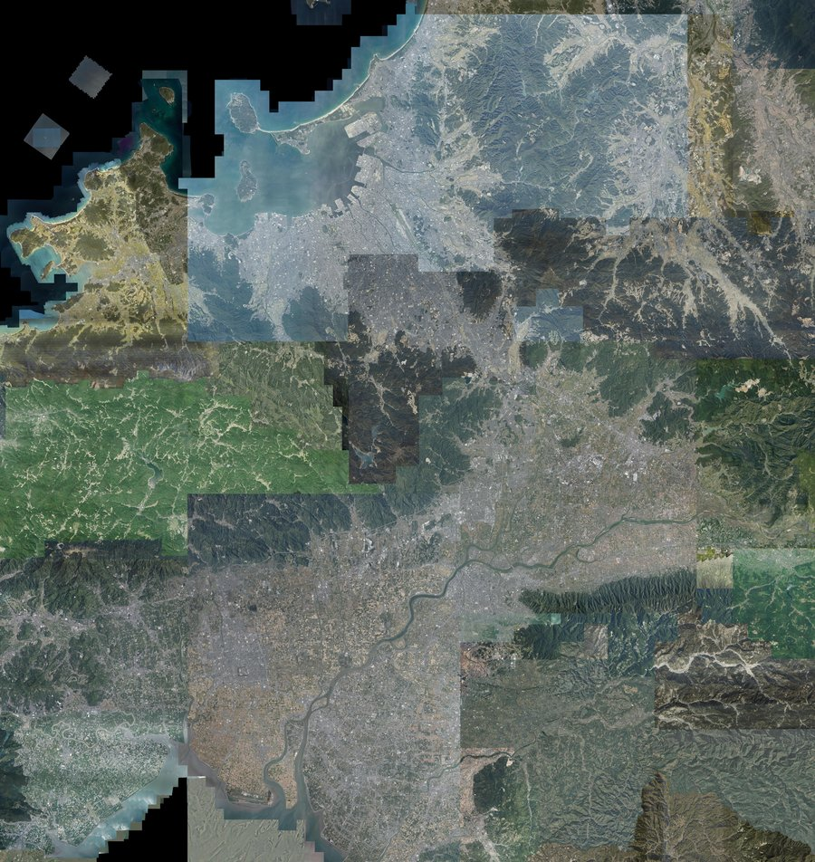
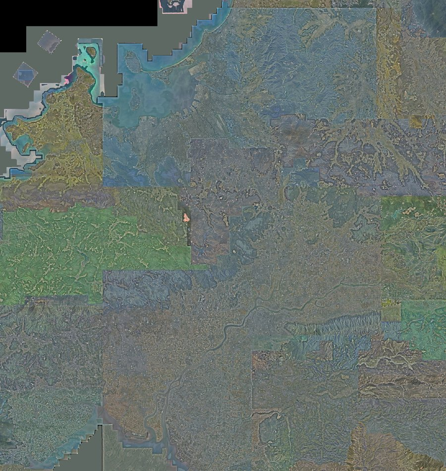
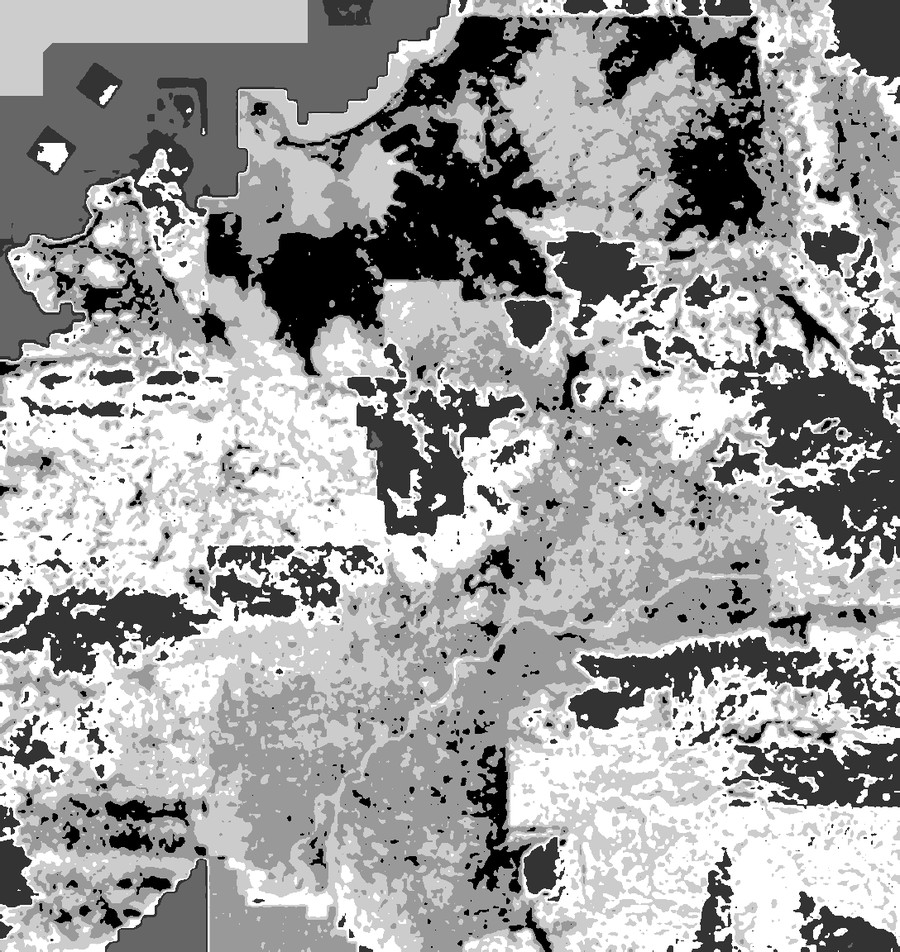
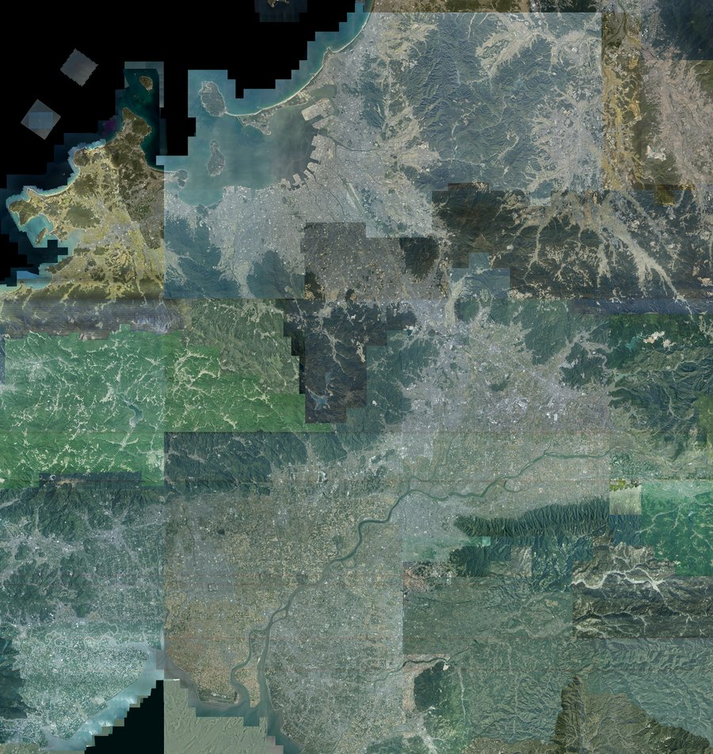
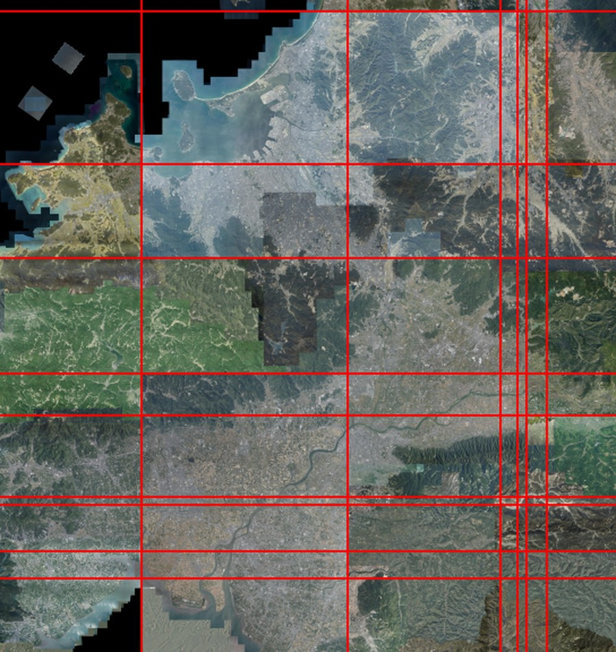
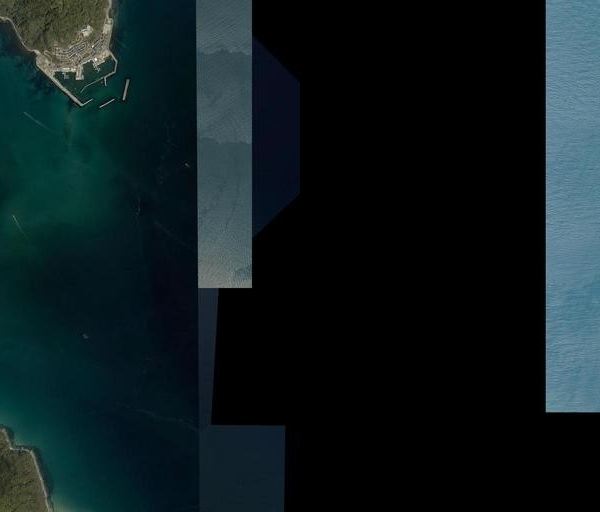
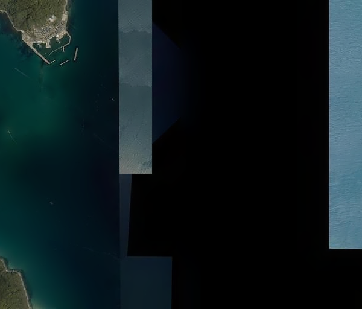

# Fukuoka color-harmonization experiment — negative result (2026-07-19)

## Motivation

kitaphoto's pyramid already solves one seam problem: the boundary between real
aerial photography and GSI's satellite gap-fill (see [README.md](README.md) /
[HANDOVER.md](HANDOVER.md)). But looking at the output, there's a second, different
kind of seam — *within* the orthophoto layer itself. GSI's "全国最新写真" is a mosaic
of many separate source photos/flight lines, each with its own color cast (capture
date, sun angle, sensor, atmospheric correction). Those casts don't match at the
seams, so wide-area views look like a patchwork of visibly different-toned
rectangles rather than one continuous photograph — most visible in
[optgeo/kitaphoto](https://github.com/optgeo/kitaphoto)'s own low-zoom pyramid, since
box-averaging doesn't erase a source photo's characteristic tone, only its local
texture.

The idea explored here: could kitaphoto's own coarse-to-fine pyramid structure be
used to detect these seams and harmonize color across them — segment cheaply at
low zoom (where local texture is averaged out and a source photo's broad tone
survives as a flat region), then refine near detected boundaries at full
resolution, then correct color across each seam (histogram/moment matching,
feathered so there's no hard edge)?

Piloted small before considering it for anything bigger: a ~55km × 65km Fukuoka
extract (z13 seed, 299 tiles, bbox `130.078125,33.137551,130.78125,33.724340`),
not the whole country.

**Result: both attempts failed to produce a real improvement.** This is a writeup
of what was tried and why it didn't work, per the decision to record the negative
result honestly rather than force a success narrative.

## Attempt 1: color-cluster segmentation

**Approach** (`scripts/experiments/fukuoka_harmonize.py`):

1. Stitch all 299 z13 tiles into one mosaic (9216×8704px).
2. Block-mean pool it down by 32× to a coarse view (288×272px) — local texture
   averages out, source-photo tone should survive as flat regions.
3. K-means cluster the coarse view's pixel colors into 6 segments.
4. Upsample the coarse label map to full resolution (nearest neighbor), then
   refine it near label boundaries: reassign each pixel within a boundary band to
   its nearest cluster centroid, computed at full resolution.
5. Harmonize: pick the largest segment as reference, apply a per-channel
   affine (gain+bias) correction to every other segment to match the reference's
   mean/std, feathered near segment boundaries (a lightweight stand-in for full
   Laplacian-pyramid multi-band blending).

**Quantitative result looked like a win**: block-mean color std dropped from
`[39.4, 38.9, 38.9]` to `[20.1, 20.0, 20.6]` — roughly half.

**Visually, it made things worse:**

| Before | After |
|---|---|
|  |  |

A strong, wrong teal/cyan cast spread across most of the scene, plus scattered
magenta artifacts.

**Root cause**, visible directly in the label map:



The clusters aren't source-photo regions — they're **land cover** (black =
forest/mountain shadow, white = urban/bright, gray = water/farmland). Land-cover
identity is a far stronger color signal than the subtle tonal difference between
two source photos of similar terrain, so unsupervised color clustering finds land
cover every time, not photo provenance. Worse, once labels are land-cover-driven,
they change constantly at fine texture scale (a single city block mixes roofs,
roads, trees) — so the "refine near boundaries" step ends up treating almost the
whole scene as boundary, and the harmonization step applies wrong corrections
almost everywhere, which is what produced the cyan wash: forest-shadow pixels
(the reference segment, since it was the largest cluster) pulling everything else
toward their tone regardless of what the other pixels actually depicted.

**Lesson**: segmenting by absolute color cannot separate "same source photo" from
"same land cover type." A usable segmentation needs a different signal.

## Attempt 2: straight-line seam detection

**Approach** (`scripts/experiments/fukuoka_harmonize_v2.py`): real photo-mosaic
seams should be straight lines (flight-strip / source-tile boundaries), unlike
land cover's organic, gradual color changes. So instead of clustering colors:

1. Build the same coarse (16×) block-mean view.
2. For every row boundary, compute the median color jump between the row just
   above and just below across the *entire row's width* (same for every column
   boundary) — two 1D "seam strength" profiles.
3. Threshold (98th percentile) + non-max-suppress those profiles to get a
   handful of candidate seam lines.
4. Partition the mosaic into strips along detected row seams, then (on the
   row-corrected result) into strips along detected column seams.
5. Harmonize sequentially: walk strips in order, match each new strip's
   near-boundary band (median, robust to a few outlier pixels) to the previous
   (already-corrected) strip's band, apply that bias to the whole strip, ramped
   in over the first ~32px so there's no hard edge right at the seam.

**First run**: essentially no visible change (block-mean std `40.85` →
`40.85`). Root cause: a feathering-direction bug — the ramp was written backwards
(`1 - dist/FEATHER_RADIUS`, decaying *to* zero away from the seam) so the
correction was confined to a ~32px sliver at each seam and never applied to the
bulk of each strip. Fixed (`dist/FEATHER_RADIUS`, ramping *up* from the seam and
staying at full strength).

**After the fix**: a small, real change (std `40.85` → `39.12`), but still not a
fix:



The correction is visible as a faint overall tone shift, but the actual obvious
seams — the blue-tinted rectangle upper right, the green farmland block on the
left, the dark forest square left-of-center — are all still there, essentially
unchanged. Checking where the detector actually placed its seams:



The detected lines (red) don't track the visible block boundaries at all — several
column detections cluster right next to each other on the right edge, which looks
like it's responding to the mountain ridge's texture or the coastline, not a
mosaic seam.

**Root cause**: the row/column-median approach implicitly assumes a seam spans
the *entire* width or height of the test region — a single line cutting all the
way across. But the real seams visible in the image are **local rectangular
blocks** (a single flight's footprint covers part of the area, not a full
row/column), so averaging a candidate line's jump across its whole length dilutes
any real local seam into noise, while incidentally strong full-length features
(a coastline, a mountain ridge) can outscore it.

**Lesson**: seam detection needs to work in 2D, matching actual (roughly
rectangular) photo-tile footprints — not a 1D projection across the whole image.

## Prior-art survey, then small OSS tool trials (2026-07-19)

Before attempt 3, stepped back to survey what prior research and off-the-shelf tools
already exist for this exact problem, rather than keep hand-rolling heuristics. The
problem splits into three sub-problems with distinct literatures:

1. **Where is the seam** (seamline placement) — classically solved by searching a
   min-cost path through the *known overlap region* between two images: dynamic
   programming, or Kwatra et al.'s graph-cut formulation ("Graphcut Textures", 2003).
   Academic work specific to orthomosaics (many overlapping images, not just a pair)
   exists too: "Global seamline networks for orthomosaic generation via local search."
2. **How to match color across it** (radiometric harmonization) — histogram/moment
   matching or photogrammetric "dodging" (per-image polynomial correction toward a
   target color surface); this is what attempt 1 above was a crude, un-segmented
   version of.
3. **How to blend smoothly across it** — multi-band/Laplacian-pyramid blending (Burt
   & Adelson, 1983) is the classic answer; feathering is the cheap approximation ODM
   uses.

Two concrete, well-known OSS candidates: **OpenCV's `stitching`/`detail` module**
(`DpSeamFinder`, `GraphCutSeamFinder`, `MultiBandBlender` — general-purpose, easy to
reach for) and **MicMac's `Tawny`** (IGN France's own orthomosaic radiometric
equalization tool — directly relevant as another national mapping agency's answer to
this exact problem). Rather than keep reasoning about these in the abstract, tried
both directly against the Fukuoka data, small.

### OpenCV `stitching`/`detail`

`scripts/experiments/opencv_blend/test_multiband.py` loads two adjacent z13 tiles and
runs `DpSeamFinder`, `GraphCutSeamFinder`, and `MultiBandBlender` on them.

**Seam finders found nothing to do** — `0` mask pixels changed from the input, on
every tile pair tried. This is expected, not a bug: DP/graph-cut seam finders search
*within a known overlap region* between two images (the classic panorama-stitching
setup). GSI's published tiles are already hard-cut with **zero overlap** between
neighbors — there's no overlap region for these algorithms to search. This confirms,
empirically, why attempt 2's from-scratch seam detection was fighting an uphill
battle: the tools built for this problem assume input data we don't have access to as
downstream consumers of the final tiled product.

**`MultiBandBlender` does run** (it doesn't need seam-finding — you can hand it a
known hard boundary directly), but demonstrating it convincingly turned out to need
more careful test-data curation than expected. An automated "find the two adjacent
tiles with the largest mean-color difference" search — the same instinct behind
attempt 1 — mostly rediscovered attempt 1's problem: the biggest differences were land
cover transitions (farmland → forested mountain) or the aerial-photo/satellite-gap-fill
boundary that `downsample.py` already handles, not two-different-real-photos seams.
The clearest example found (tiles 7059,3281 / 7060,3281, a coastal/harbor scene) turned
out to straddle exactly that aerial/satellite boundary rather than an orthophoto-internal
one:

| Before | After (MultiBandBlender) |
|---|---|
|  |  |

The blend is visually subtle and reasonable where it applies, but this wasn't the
target case. **Locating a clean, unambiguous example of two different real aerial
photos meeting — without any source/footprint metadata — turned out to be nearly as
hard as detecting the seam itself.** That's itself a useful data point: even a
demo requires information we don't have.

### MicMac `Tawny` (via Docker, `mzellou/micmac`)

Ran directly: `mm3d Tawny . Out=test_mosaic.tif` against a directory containing two
of our tiles. Failed immediately, looking for MicMac-native input:

```
"NKS-Set-OfPattern@^Ort_(.*)\.tif": 0 matches.
For required file [./MTDOrtho.xml]
Cannot open
```

This confirms the same architectural point directly: Tawny's radiometric equalization
runs on the output of MicMac's own `Porto` orthorectification stage —
`Ort_*.tif` tiles plus an `MTDOrtho.xml` describing each tile's footprint/overlap,
generated earlier in MicMac's own photogrammetric pipeline (camera orientation, bundle
adjustment, etc.). **It cannot be pointed at arbitrary pre-baked orthophoto tiles from
a different pipeline** — it needs the overlap/footprint metadata that only exists
*before* the images get flattened into a single mosaic per tile, which is exactly the
information GSI's `seamlessphoto512.pmtiles` (and depot's re-tiled version of it) no
longer carries.

### What this settles

Both DP/graph-cut seam finding and MicMac's Tawny — probably the two most credible
off-the-shelf answers to this problem — **require access to the original overlapping
per-photo imagery with known geometry, upstream of GSI's own mosaicking step**. As an
external consumer of the already-published `seamlessphoto512.pmtiles`, that
information isn't available. Any further attempt at this from kitaphoto's position
needs either (a) GSI's own internal photo/flight footprint data (out of reach for this
project) or (b) inferring seams and matching regions purely from pixels — which is
exactly what attempts 1 and 2 above already tried, without success.

### A third tool family: OpenAerialMap / marblecutter

Checked one more OSS lineage: [HOTOSM's OpenAerialMap](https://github.com/hotosm/OpenAerialMap)
stack ([`oam-api`](https://github.com/hotosm/oam-api) catalog,
[`oam-dynamic-tiler`](https://github.com/hotosm/oam-dynamic-tiler) and its successor
[`marblecutter`](https://github.com/mojodna/marblecutter), plus the newer
[`cogeo-mosaic`](https://github.com/developmentseed/cogeo-mosaic)/TiTiler-mosaic
approach) — this is the "serve a mosaic of many independently-captured aerial/drone
images" problem, closer to kitaphoto's actual situation than panorama stitching or
full photogrammetric reconstruction.

**A genuinely useful cross-reference turned up**: [hotosm/OpenAerialMap issue
#129](https://github.com/hotosm/OpenAerialMap/issues/129), "User mosaic stitching
problem," is marblecutter's author (mojodna) independently diagnosing almost exactly
kitaphoto's black-nodata-pixel problem — JPEG-compressed imagery without a proper
alpha/mask channel lets NODATA values bleed through as black artifacts at tile edges.
One proposed fix in that thread: *"A way to fight these artifacts is to fill black
under mask with average color of not-NODATA pixels"* — this is the same idea as
`downsample.py`'s `clean_seed_tile()` (fill black pixels from a reference source),
independently arrived at by a production system. Good validation that the black-pixel
fix wasn't an ad hoc hack.

**But**: checked marblecutter's README and `marblecutter-tools`' documented feature
set directly (image transcoding to COG, block/mask/overview generation, source
selection and priority ordering for which image wins at a given tile) — **no mention
of color correction, color balancing, histogram matching, or radiometric harmonization
anywhere in either**. OAM's stack solves *which* image to show per tile and how to
handle nodata cleanly; it does not touch making genuinely different source images
look consistent with each other.

That's a third, independent tool family (panorama stitching → OpenCV; full
photogrammetry → MicMac; imagery cataloging/serving → OpenAerialMap) confirming the
same boundary: **radiometric harmonization across independently-captured images lives
exclusively in the photogrammetry-pipeline tools that have access to per-image
overlap/footprint data (Tawny, ArcGIS dodging) — nothing in the
post-hoc-serving/mosaicking tool family does this**, regardless of whether that family
is built for camera panoramas or for cataloged aerial imagery.

## Conclusion

Neither color-harmonization attempt (1 or 2) produced a usable result, and the
follow-up survey confirms the standard tools for this problem (OpenCV's seam finders,
MicMac's Tawny, and OpenAerialMap's marblecutter/cogeo-mosaic lineage) aren't directly
usable either, for a structural reason rather than a tuning one: they need
overlap/footprint metadata that doesn't survive into the published tiled product, or
(OAM's case) don't attempt cross-image color harmonization at all. Both failures are
informative, though:

- Attempt 1 confirms color-based segmentation alone can't distinguish "same
  photo source" from "same land cover" — any future approach needs a different
  signal than absolute pixel color, or needs to constrain the segmentation
  spatially (e.g., known tile/flight footprints) rather than clustering freely.
- Attempt 2 confirms that seams are local 2D rectangular regions, not lines
  spanning the whole scene — the right next step (not attempted here) would be
  genuine 2D block/rectangle detection, closer to what orthomosaic software does
  with actual camera footprint metadata, rather than inferring boundaries purely
  from pixel statistics after the fact.
- The OSS survey confirms *why* attempt 2's instinct (real seams, real tools) still
  wasn't enough: the standard tools assume access to pre-mosaic overlap data that
  simply isn't in `seamlessphoto512.pmtiles`. This reframes the open problem — it's
  not "which blending algorithm" but "how to recover or approximate footprint/overlap
  information from a single already-flattened image per tile."

**This idea is shelved for now, not abandoned** — color harmonization across
GSI's orthophoto mosaic seams remains a real, open problem. The most promising
untried direction is asking whether GSI has (or could expose) the original per-photo
footprint/flight metadata Tawny-style tools actually need, rather than continuing to
infer it from pixels alone.
